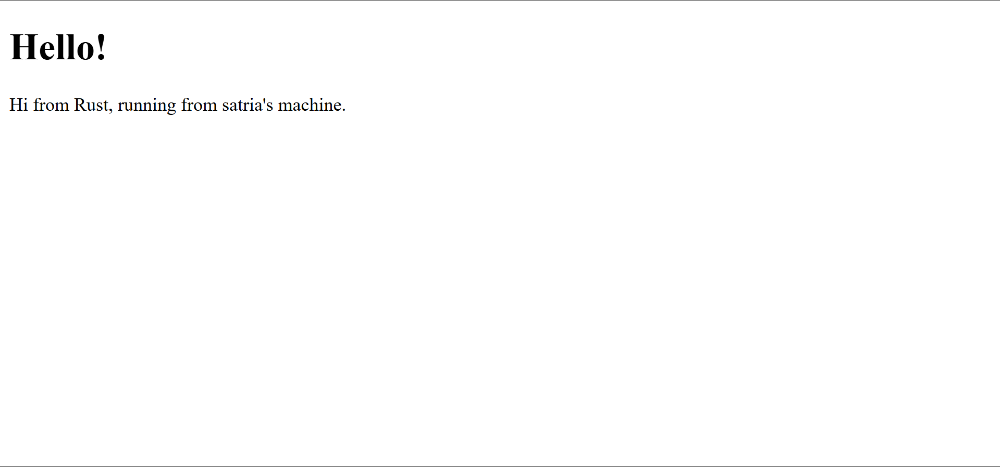
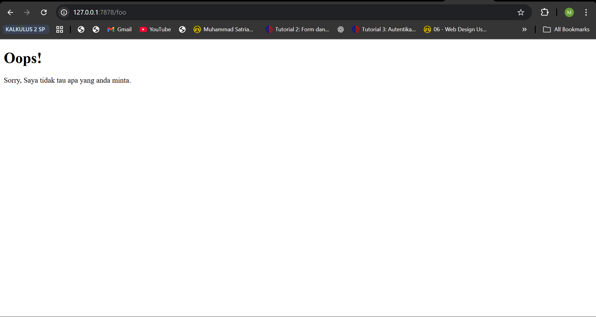

## Reflection 1
Fungsi handle_connection berperan sebagai unit pemroses utama untuk setiap permintaan yang masuk melalui protokol TCP. Berikut adalah ringkasan teknis mengenai cara kerja metode tersebut:

Efisiensi Pembacaan Data
Penggunaan BufReader bertujuan untuk mengoptimalkan kinerja sistem. Alih-alih melakukan pembacaan data secara langsung dari TcpStream yang melibatkan banyak system call, BufReader menyimpan data ke dalam memori perantara (buffer) sehingga proses pembacaan menjadi lebih cepat dan efisien.

Transformasi Data dan Iterator
Data yang diterima diproses menggunakan rangkaian fungsi iterator untuk mendapatkan informasi yang relevan:

- Lines: Membagi aliran data mentah menjadi sekumpulan baris teks.

- Map: Melakukan ekstraksi nilai dari tipe data Result agar data teks bisa diolah lebih lanjut.

- Take While: Berfungsi sebagai pembatas logis. Sesuai standar HTTP, baris kosong menandakan akhir dari bagian header permintaan. Fungsi ini memastikan program berhenti membaca tepat pada batas tersebut.

- Collect: Menggabungkan hasil pemrosesan ke dalam sebuah Vector agar data tersimpan secara permanen di memori untuk kebutuhan analisis atau logging.

Visualisasi Output
Pencetakan hasil menggunakan format debug dalam println bertujuan untuk mempermudah pemeriksaan struktur data. Hal ini memastikan bahwa seluruh pesan yang dikirimkan oleh klien telah diterima secara utuh dan sesuai dengan format yang diharapkan sebelum server memberikan respon balik.

## Reflection 2
Pada tahap ini, fungsi handle_connection telah diperbarui sehingga tidak hanya membaca permintaan, tetapi juga memberikan respons balik. Program kini membaca file eksternal hello.html menggunakan modul fs (file system) dan mengirimkan isinya kembali ke klien melalui stream. 

Hal yang dipelajari adalah pentingnya mematuhi format protokol HTTP, yaitu menyertakan baris status, header (seperti Content-Length), dan pemisah baris kosong sebelum mengirimkan isi konten. Hal ini memungkinkan browser untuk mengenali dan menampilkan halaman HTML dengan benar.

## Reflection 3
Pada tahap ini, dilakukan proses refactoring terhadap kode untuk meningkatkan efisiensi dan kemudahan pemeliharaan (maintainability).

### Mengapa Refactoring Diperlukan?
Sebelumnya, terdapat duplikasi kode pada bagian pembacaan file dan pengiriman respons di dalam blok if dan else. Duplikasi ini berisiko menimbulkan kesalahan jika kita ingin mengubah cara server mengirim respons di masa mendatang. Dengan refactoring, logika yang sama dikumpulkan di satu tempat, sehingga kode menjadi lebih "DRY" (Don't Repeat Yourself).

### Pemisahan Respons (Split Response)
Pemisahan dilakukan dengan menggunakan teknik pattern matching (atau tuple di dalam if ekspresi). Program sekarang hanya menentukan dua variabel kunci, yaitu status_line dan filename, berdasarkan validasi request_line. Setelah nilai tersebut ditentukan, proses pembacaan file dan pengiriman data dilakukan satu kali saja di akhir fungsi. Hal ini memisahkan antara "logika pemilihan konten" dengan "logika teknis pengiriman data".

## Reflection 4
Pada tahap ini, kita mensimulasikan perilaku server dalam menangani permintaan yang lambat menggunakan rute /sleep.

### Simulasi Slow Response
Kode thread::sleep(Duration::from_secs(10)); digunakan untuk menahan proses selama 10 detik sebelum server mengirimkan respons. Jika kita membuka dua jendela browser dan mengakses /sleep di jendela pertama, lalu segera mengakses halaman utama `/` di jendela kedua, kita akan menyadari bahwa halaman kedua tidak akan terbuka sampai jendela pertama selesai diproses.

### Mengapa Hal Ini Terjadi?
Hal ini membuktikan bahwa server kita saat ini bekerja secara single-threaded. Artinya, server hanya bisa memproses satu koneksi dalam satu waktu. Ketika satu koneksi sedang tertahan, seluruh sistem akan "membeku" bagi pengguna lain karena antrean koneksi berikutnya harus menunggu proses sebelumnya selesai sepenuhnya. 

## Reflection 5
Proyek ini berfokus pada pembangunan web server fungsional menggunakan bahasa pemrograman Rust, yang mengeksplorasi konsep manajemen jaringan, sistem berkas, hingga concurrency tingkat lanjut.

1. Fondasi Penanganan Koneksi TCP
Pengembangan dimulai dengan mengimplementasikan penanganan koneksi masuk menggunakan TcpListener. Aliran data mentah dari TcpStream dikelola secara efisien menggunakan BufReader, yang meminimalkan beban sistem dengan cara menyimpan data dalam memori perantara (buffer) sebelum diproses. Data tersebut kemudian ditransformasi menjadi baris-baris teks untuk divalidasi sesuai dengan standar protokol HTTP.

2. Pengiriman Konten Statis dan Validasi Request
Server dikembangkan agar mampu melayani permintaan spesifik dengan membaca file HTML eksternal menggunakan modul fs. Logika pemilihan konten diterapkan menggunakan penandaan rute (routing). Jika permintaan diarahkan ke halaman utama (/), server akan mengirimkan dokumen sukses, sedangkan permintaan ke alamat lain akan secara otomatis diarahkan ke halaman error 404. Hal ini dilakukan melalui proses refactoring untuk memisahkan antara logika penentuan status dengan logika teknis pengiriman respons, sehingga kode tetap efisien dan mudah dikembangkan.

3. Analisis Keterbatasan Single-Threaded
Untuk memahami tantangan performa, dilakukan simulasi "Slow Response" menggunakan rute /sleep yang menahan eksekusi selama beberapa detik. Hasil simulasi menunjukkan bahwa server yang bekerja pada satu utas tunggal (single-threaded) akan mengalami kemacetan total jika menangani permintaan yang berat. Permintaan baru tidak dapat diproses sampai permintaan sebelumnya selesai sepenuhnya, yang menyebabkan degradasi pengalaman pengguna secara signifikan.

4. Implementasi Sistem Thread Pool (Multithreading)
Solusi akhir dari proyek ini adalah penerapan sistem Thread Pool untuk menangani banyak koneksi secara bersamaan (concurrently).

Sistem ini terdiri dari beberapa komponen kunci:
- Worker: Unit kerja yang menampung utas (thread) mandiri untuk mengeksekusi tugas secara paralel.

- MPSC Channel: Jalur komunikasi multi-producer, single-consumer yang digunakan untuk mengirimkan tugas dari server utama ke antrean worker.

- Arc & Mutex: Mekanisme sinkronisasi data yang digunakan untuk membagikan antrean tugas ke seluruh worker secara aman, memastikan tidak ada tugas yang diambil oleh dua utas berbeda secara bersamaan.

Dengan arsitektur ini, server kini mampu memproses permintaan secara konkuren, di mana permintaan berat tidak lagi menghambat kelancaran akses pengguna lainnya di jalur yang berbeda.